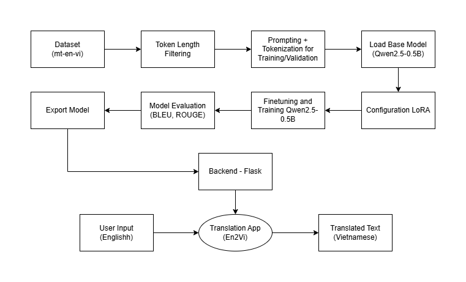
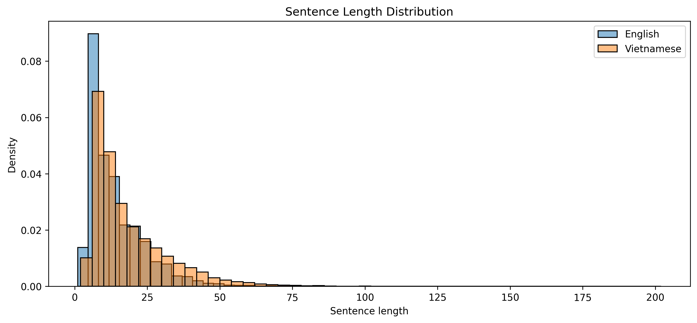
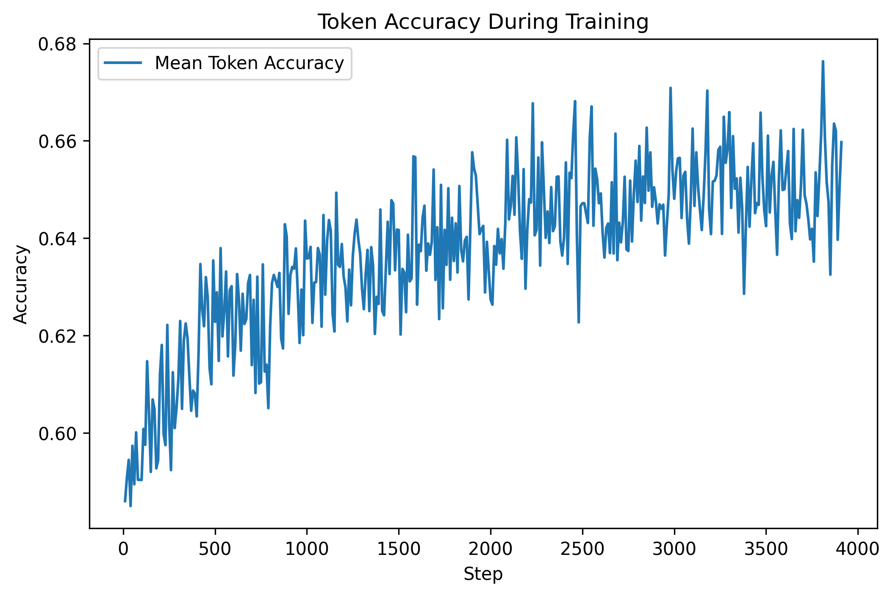
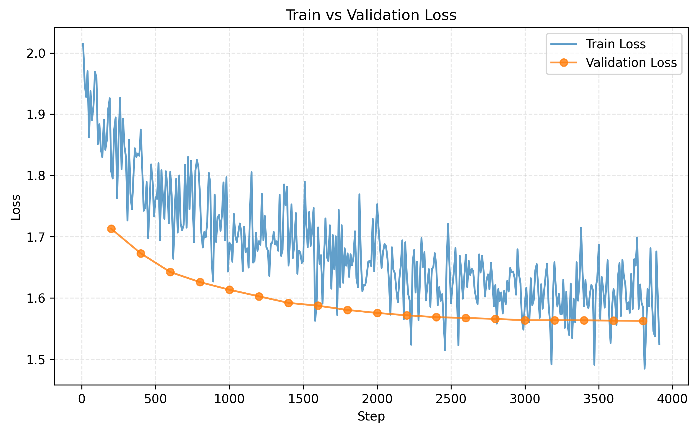
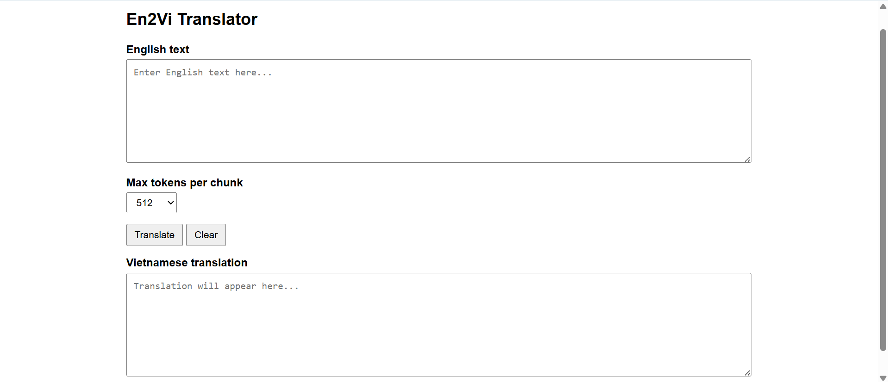
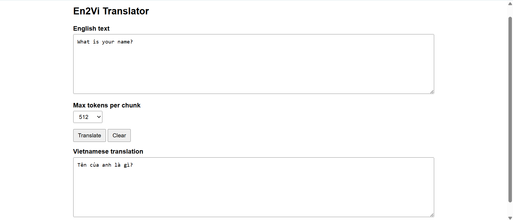

<h1 align="center">
Translation App
</h1>

(Ứng dụng dịch thuật)

## MỤC LỤC

- [GIỚI THIỆU TỔNG QUÁT](#giới-thiệu-tổng-quát)
- [BỘ DỮ LIỆU](#bộ-dữ-liệu)
- [KẾT QUẢ ĐẠT ĐƯỢC](#kết-quả-đạt-được)
- [CẤU TRÚC MÃ NGUỒN](#cấu-trúc-mã-nguồn)
- [CÔNG NGHỆ TIÊU BIỂU](#công-nghệ-tiêu-biểu)
- [MỘT SỐ HÌNH ẢNH](#một-số-hình-ảnh)

## GIỚI THIỆU TỔNG QUÁT

Đây là dự án xây dựng một **Web App dịch thuật văn bản một chiều từ Anh sang Việt (En2Vi)**, dựa trên mô hình ngôn ngữ lớn **Qwen2.5-0.5B**, được Finetune trên tập dữ liệu song ngữ Anh - Việt bằng các kỹ thuật để tối ưu tài nguyên.

Bước đầu tiên của dự án là **phân tích khám phá dữ liệu** (Exploratory Data Analysis – EDA) đối với tập dữ liệu song ngữ, quá trình này diễn ra trên nền tảng **Kaggle** (trang Web cung cấp một lượng lớn GPU miễn phí) từ đó đưa ra được những kết luận quan trọng về phân bố chiều dài của cặp văn bản song ngữ.

Tiếp theo là bước xây dựng mô hình, cũng diễn ra trên Kaggle. Mặc dù tập dữ liệu được chia sẵn từ Hugging Face, ta sẽ chỉ lấy một phần nhỏ vì vấn đề tài nguyên, với phân bố Train/Validation/Test tương ứng với **25000/2000/2000 mẫu** dữ liệu. Sau đó sẽ tiến hành lọc dữ liệu theo độ dài Token để mô hình có thể học hiệu quả:

1. Câu tiếng Anh có độ dài trong khoảng **(5, 40)** Token
2. Câu tiếng Việt có độ dài trong khoảng **(5, 50)** Token

Sau đó tiến hành điều chỉnh **Prompt** để phù hợp với cấu trúc của mô hình Qwen, cũng như xây dựng **Tokenization** cho tập Train và Validation để đảm bảo tính nhất quán của dữ liệu khi huấn luyện. Bước tiếp theo là tải mô hình Base **Qwen2.5-0.5B**, kết hợp với việc cấu hình kỹ thuật **LoRA (Low-Rank Adaptation)** để Finetune mô hình được tốt hơn. Nói thêm một chút, kỹ thuật này cho phép:

1. Giảm số lượng tham số cần huấn luyện.
2. Tiết kiệm bộ nhớ GPU.
3. Phù hợp với môi trường huấn luyện có tài nguyên hạn chế.

Sau bước này thì vào giai đoạn cấu hình tham số huấn luyện bằng thư viện **TrainingArguments**, và huấn luyện bằng **SFTTrainer**. Trong suốt quá trình huấn luyện, các đoạn **Log** được ghi lại để đánh giá mô hình bằng nhiều biểu đồ khác nhau (Accuracy/Loss). Ngoài ra, ta cũng sử dụng các chỉ số như **BLEU** và **ROUGE** khi đánh giá trên tập dữ liệu Test để xem khả năng tổng quát hoá và chất lượng dịch thuật của mô hình.

Để thử nghiệm với dữ liệu mới (Inference), ta đưa vào một câu tiếng Anh cơ bản. Tiến hành tải lại mô hình Base và mô hình mới vừa được Finetune, sau đó áp dụng Prompt và Tokenizer đã được xây dựng từ trước để xem được bản dịch tiếng Việt tương ứng. Kết thúc của quá trình huấn luyện chính là đóng gói mô hình thành Zip để tiện cho việc tải xuống.

Bước thứ hai, tải mô hình đã đóng gói vào phần Web App được xây dựng từ **Flask** Backend, kết hợp với giao diện **HTML** đơn giản. Khi tương tác trên trình duyệt, ta nhập vào văn bản là tiếng Anh thì kết quả nhận được kết quả chính là văn bản dịch thuật bằng tiếng Việt.

## BỘ DỮ LIỆU

Đường dẫn Dataset: https://huggingface.co/datasets/ncduy/mt-en-vi

Tập dữ liệu của dự án này có tên là **mt-en-vi**, một tập dữ liệu song ngữ Anh – Việt (English – Vietnamese), liên quan đến những văn bản song ngữ được tổng hợp từ nhiều nguồn tiếng Anh - Việt khác nhau. Tập dữ liệu nằm trên trang Web Hugging Face, nơi lưu trữ các tập dữ liệu cũng như mô hình nổi tiếng và uy tín.

**Thông tin mô tả của Dataset:** Chứa những cặp câu song song giữa hai ngôn ngữ Anh - Việt, với ba thuộc tính chính:

1. **en:** Câu văn bản bằng tiếng Anh.
2. **vi:** Câu văn bản bằng tiếng Việt.
3. **source:** Nguồn gốc của cặp câu song ngữ (OpenSubtitles v2018, TED2020 v1, QED v2.0a, WikiMatrix v1, wikimedia v20210402, vietnamsongngu.com, baosongngu.net, Tatoeba v2021-07-22)

Tập dữ liệu này đã được chia sẵn trên Hugging Face thành ba tập **Train/Validation/Test**, do đó trong quá trình sử dụng có thể không cần tự chia lại dữ liệu.

## KẾT QUẢ ĐẠT ĐƯỢC

Dưới đây là các thông số đạt được trong quá trình xây dựng dự án:

- BLEU (0.2557): Giá trị cho thấy bản dịch đạt mức chấp nhận được, mô hình dịch đúng ý chính nhưng chưa trùng khớp cao về hình thức câu.

- ROUGE-1 (0.6366): Giá trị cao chứng tỏ mô hình nắm tốt từ vựng quan trọng và bảo toàn nội dung chính của câu dịch.

- ROUGE-2 (0.3897): Mức điểm cho thấy mô hình tạo được nhiều cụm từ hợp lý, dù cấu trúc câu vẫn còn khác so với tham chiếu.

- ROUGE-L (0.5534): Giá trị thể hiện khả năng giữ mạch nội dung khá tốt, bản dịch nhìn chung liền mạch và dễ hiểu.

- ROUGE-Lsum (0.5533): Kết quả xác nhận chất lượng dịch ổn định trên toàn câu, ít lỗi lặp và không làm sai lệch ý nghĩa tổng thể.

Mặc dù kết quả nhìn có vẻ khả quan, nhưng nếu xét nhiều trường hợp thực nghiệm thì kết quả dịch thuật chưa được như mong muốn.

## CẤU TRÚC MÃ NGUỒN

[backend](backend/) : Chứa mã nguồn của Backend Flask. 
[model](model/) : Chứa mô hình được đóng gói. 
[notebook](notebook/) : Chứa các Notebook trực quan hóa dữ liệu và huấn luyện mô hình. 
[picture](picture/) : Chứa danh mục hình ảnh.

## CÔNG NGHỆ TIÊU BIỂU

Một số công nghệ được áp dụng trong dự án: Python, Flask, PyTorch, Hugging Face Transformers, PEFT (LoRA)

## MỘT SỐ HÌNH ẢNH

  

<i>Pipeline tổng thể của dự án.</i>

 

  

<i>Phân bố độ dài chuỗi dữ liệu đầu vào.</i>

 

  

<i>Độ chính xác của mô hình theo từng Token.</i>

 

  

<i>Biểu đồ mất mát giữa Training và Validation.</i>

 

  

<i>Giao diện của dự án.</i>

 

  

<i>Kết quả thực nghiệm trên giao diện.</i>

